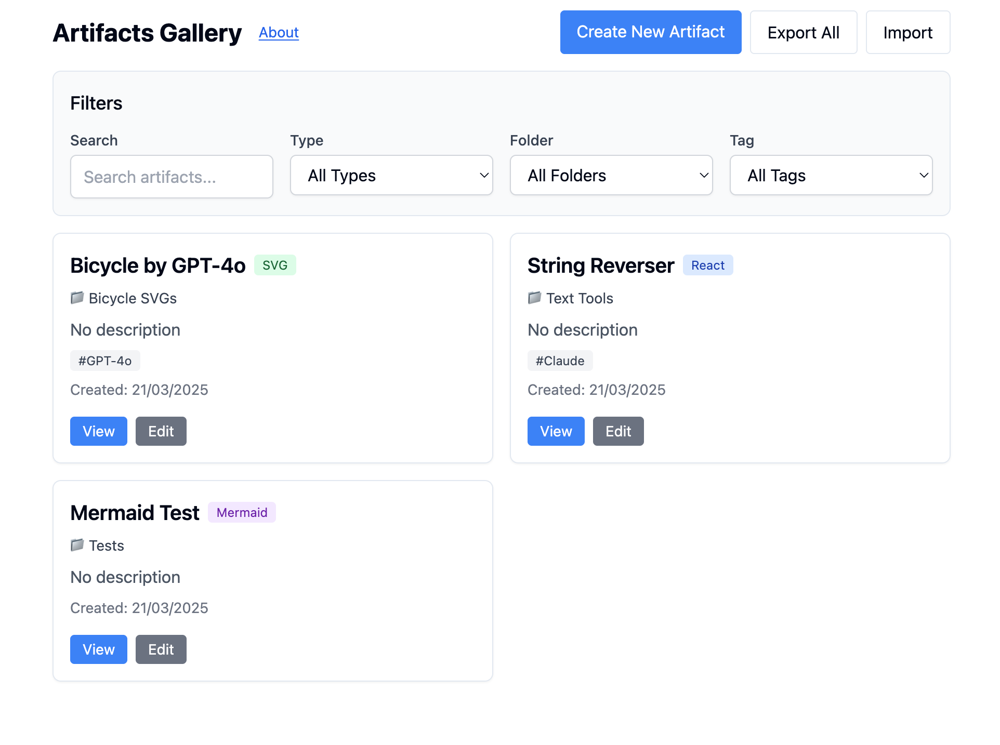

# ArtifactVault

A comprehensive gallery and runtime environment for Claude AI-generated artifacts - store, organize, and run various types of artifacts in one place.

## Overview

ArtifactVault allows you to:

1. **Create and save** artifacts generated by Claude AI
2. **Organize** them with tags and folders
3. **Run** different types of artifacts:
   - React components (with full reactivity)
   - SVG images 
   - Mermaid diagrams
4. **Filter and search** to find exactly what you need
5. **Import and export** your artifact collections



## Origin

ArtifactVault was created by Dominik Lukeš ([@techczech](https://github.com/techczech)) using Claude AI. It is based on the original "Claude Artifact Runner" project by Claudio Silva ([original repository](https://github.com/claudio-silva/claude-artifact-runner)), which provided a foundation for running Claude-generated artifacts.

The original project was substantially extended with:
- Support for multiple artifact types (SVG, Mermaid)
- Organization features (tags, folders)
- Advanced filtering and search
- Improved user interface

This project maintains the MIT License of the original work.

## Key Features

- **Live Component Rendering**: Run React components with JSX syntax directly in the browser
- **SVG Rendering**: Display and edit SVG images with proper sanitization
- **Mermaid Diagrams**: Create and render Mermaid diagrams for flowcharts, sequence diagrams, etc.
- **Organization System**: Organize artifacts with folders and tags
- **Advanced Filtering**: Filter artifacts by type, folder, tag, or search text
- **Import/Export**: Share collections with others via JSON files
- **GitHub Pages Compatibility**: Works both locally and when deployed

## How ArtifactVault Works

### Browser Storage
ArtifactVault uses browser localStorage to store your artifacts, which means:
- Your data persists between sessions without needing a server
- No login or account required
- Your artifacts stay on your device (private by default)
- You can export artifacts to files for sharing or backup

### Artifact Execution
The application uses various technologies to render different types of content:
- React components are transpiled and executed directly in the browser
- SVG images are sanitized and rendered safely
- Mermaid diagrams are processed by the Mermaid.js library

## Getting Started

1. Clone the repository:
   ```
   git clone https://github.com/yourusername/artifact-vault.git
   cd artifact-vault
   ```

2. Install dependencies:
   ```
   npm install
   ```

3. Start the development server:
   ```
   npm run dev
   ```

4. Open your browser and visit `http://localhost:5173` to see the gallery

## Creating and Running Artifacts

1. Click "Create New Artifact" in the gallery
2. Give your artifact a title and description
3. Select the appropriate type (React Component, SVG, or Mermaid)
4. Optionally assign a folder and tags for organization
5. Paste your code
6. Click "Save Artifact"
7. The artifact will be rendered in the view page

## Organization and Filtering

### Tagging System
- Add multiple tags to each artifact for categorization
- Filter the gallery by tag to find related artifacts
- Common tags might include purpose (e.g., "dashboard", "form"), style (e.g., "dark", "minimalist"), or status (e.g., "complete", "draft")

### Folder System
- Organize artifacts into logical folders
- Group related artifacts together (e.g., UI Components, Charts, Diagrams)
- Filter the gallery by folder to focus on specific categories

### Search and Filtering
- Filter artifacts by type (React, SVG, Mermaid)
- Filter by tags or folders
- Search by title or description
- Combine filters for precise results

## Example Content

### React Component Example
```jsx
import React, { useState } from 'react';

const Counter = () => {
  const [count, setCount] = useState(0);
  
  return (
    <div className="p-4">
      <h2 className="text-xl font-bold mb-4">Counter Example</h2>
      <div className="flex items-center gap-2">
        <button 
          onClick={() => setCount(count - 1)}
          className="bg-red-500 text-white px-3 py-1 rounded"
        >
          -
        </button>
        <span className="text-2xl">{count}</span>
        <button 
          onClick={() => setCount(count + 1)}
          className="bg-green-500 text-white px-3 py-1 rounded"
        >
          +
        </button>
      </div>
    </div>
  );
};

export default Counter;
```

### SVG Example
```html
<svg viewBox="0 0 100 100" xmlns="http://www.w3.org/2000/svg">
  <circle cx="50" cy="50" r="40" stroke="blue" stroke-width="2" fill="red" />
  <rect x="10" y="10" width="30" height="30" fill="green" />
  <text x="50" y="50" font-family="Arial" font-size="10" text-anchor="middle" fill="white">SVG Test</text>
</svg>
```

### Mermaid Example
```
flowchart TD
    A[Start] --> B{Is it working?}
    B -->|Yes| C[Great!]
    B -->|No| D[Debug]
    D --> B
```

## Deployment

### GitHub Pages Deployment

1. Update the repository information in package.json:
   ```json
   "homepage": "https://yourusername.github.io/artifact-vault",
   "repository": {
     "type": "git",
     "url": "https://github.com/yourusername/artifact-vault.git"
   }
   ```

2. Run the deploy command:
   ```
   npm run deploy
   ```

## Technical Details

ArtifactVault is built using:
- **React** with **TypeScript** for the UI framework
- **Vite** for build and development tooling
- **Tailwind CSS** for styling
- **Zustand** for state management
- **React Router** for navigation
- **Mermaid.js** for diagram rendering
- **DOMPurify** for SVG sanitization
- **Babel** for JSX transpilation

## License

This project is open source and available under the [MIT License](LICENSE), the same as the original Claude Artifact Runner.

## Acknowledgements

- [Claudio Silva](https://github.com/claudio-silva) for the original Claude Artifact Runner
- [Claude AI](https://claude.ai) used for development assistance and extending the original project
- All contributors to the libraries and tools used in this project